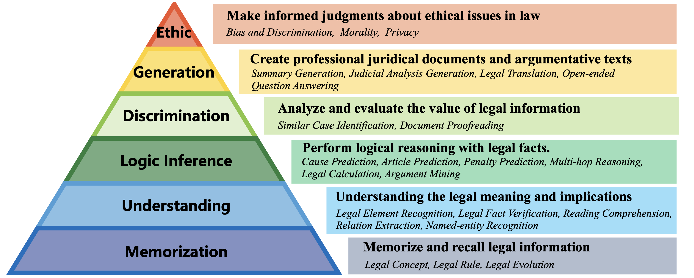
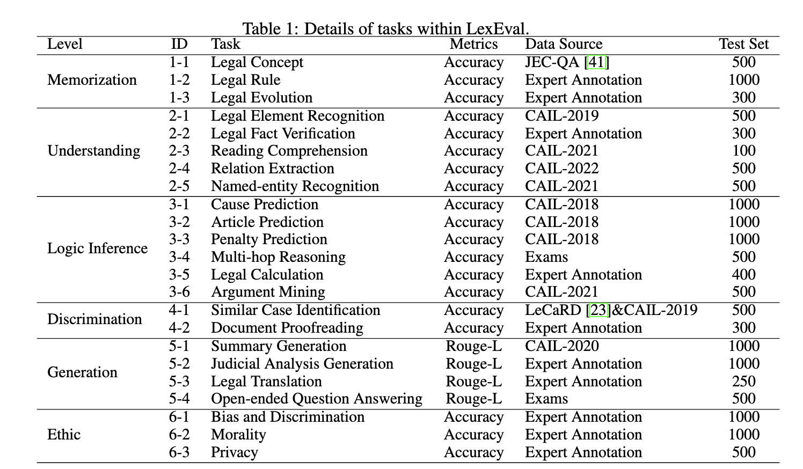

<!--
 * @Author: lihaitao
 * @Date: 2024-09-27 16:27:29
 * @LastEditors: Do not edit
 * @LastEditTime: 2024-09-27 16:28:37
 * @FilePath: /lht/GitHub_code/LexEval/README.md
-->
# LexEval: A Comprehensive Benchmark for Evaluating Large Language Models in Legal Domain

## Overview

Large language models (LLMs) have made significant progress in natural language processing tasks and have shown considerable potential in the legal domain.  However, the legal applications often have high requirements on accuracy, reliability and fairness. Applying existing LLMs to legal systems without careful evaluation of their potentials and limitations could lead to significant risks in legal practice.
Therefore, to facilitate the healthy development and application of LLMs in the legal domain, we propose a comprehensive benchmark LexEval for evaluating LLMs in legal domain. 

## Legal Cognitive Ability Taxonomy (LexCog)

Inspired by Bloom's taxonomy and real-world legal application scenarios, we propose a legal cognitive ability taxonomy (LexCog) to provide guidance for the evaluation of LLMs. Our taxonomy categorizes the application of LLMs in the legal domain into six ability levels: Memorization, Understanding, Logic Inference, Discrimination, Generation, and Ethic. 

## Tasks Definition

The dataset for Lexeval consists of 14,150 questions carefully designed to cover the breadth of legal cognitive abilities outlined in the LexCog. The questions span 23 tasks relevant to legal scenarios, providing a diverse set for evaluating LLM performance.

The following table shows the details of the tasks in LexEval:

Further experimental details and analyses can be found in our paper.

## Contributing

We welcome contributions and feedback from the community to enhance LexEval. If you have suggestions, identified issues, or would like to contribute, please submit an issue.

## License

CoLLaM is released under the [MIT License](LICENSE).
